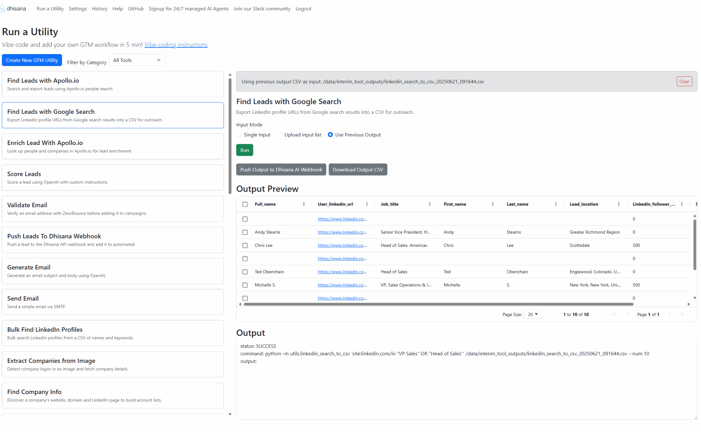

# GTM Workflows Builder AI Agent - Dhisana AI

## Project Introduction Video

<a href="https://www.loom.com/share/748524a3696a4873b8047c7c842ee0de" target="_blank">Watch project introduction</a>



## How Does GTM Builder Agent Work?

We’ve seeded the repository with few-shot examples of essential tools and workflows commonly used in GTM operations. When a GTM engineer describes a new workflow in natural language, the agent selects relevant examples, applies the user’s instructions along with a meta prompt, and generates a new tool or workflow. It then runs tests and outputs a ready-to-use tool.

You can run these tools repeatedly on any CSV or input source to parse customer websites, extract leads, conduct research and qualification, and push results to destinations like CRMs, Dhisana webhooks, or Clay tables.

This approach creates a cost-efficient and accurate toolchain for GTM engineers—cheaper than LLM-heavy pipelines and more precise than generic solutions, as it’s purpose-built for GTM workflows and playbooks.

Project includes tools for lead discovery, enrichment and qualification, CRM data hygiene, AI-powered outreach content generation and more—helping teams accelerate pipeline generation and reduce manual effort in GTM operations.

All tools are free and open source. Feel free to build, use, contribute, and share feedback.


This repo is *vibe code ready*: just describe the workflow you want in natural language and you'll have a custom GTM tool up and running in about five minutes.

The project is contributed to and maintained by the **[Dhisana AI](https://www.dhisana.ai)** team. Community contributions are welcome!

Dhisana AI also provides a managed offering of these workflows and more. It delivers personalized outreach—including LinkedIn outreach—powered by over 100 signals and sources, all hosted as a secure managed service. You can sign up and get started in 10 minutes at <https://www.dhisana.ai>.

Vibe code and add your own GTM workflow in 5 min! [Vibe coding instructions](docs/vibe_coding_workflows.md)

View this project on [GitHub](https://github.com/dhisana-ai/gtm-ai-tools). Signup and get a 24/7 managed version of this service that runs an AI Agent for you in the cloud with all these workflows and more.

Join the discussion on our [Slack community channel](https://join.slack.com/t/dhisanaaicommunity/shared_invite/zt-37bzb09dc-VFgu_1PwM2CXORH1e6s8Xg).


## Quick Start

You can either host the utilities in the cloud with Fly.io or run them locally
in Docker.

### Option&nbsp;1: Cloud hosted on Fly.io

1. Sign up at <https://fly.io>.
2. Add your `OPENAI_API_KEY` as an environment variable in Fly.io.
3. Connect the repository <https://github.com/dhisana-ai/gtm-ai-tools> in the
   Fly.io dashboard and launch the app.
4. Optionally add any other variables from `.env` depending on the tools you
   want to run, or create your own tool with **Create New GTM Utility** once the
   app is deployed.

See [Fly.io setup](docs/flyio_setup.md) for more details.

### Option&nbsp;2: Run locally with Docker

1. **Clone the repository**
   ```bash
   git clone https://github.com/dhisana-ai/gtm-ai-tools.git
   cd gtm-ai-tools
   ```
2. **Build the Docker image** (or run `task docker:build`)
   ```bash
   docker build -t gtm-ai-tools .
   ```
3. **Add your environment variables** to `.env` (see
   [Environment variables](docs/environment_variables.md) and
   [API key setup](docs/api_keys.md))
   ```bash
   OPENAI_API_KEY=...
   OPENAI_MODEL_NAME=gpt-4.1
   SERPER_API_KEY=...
   DHISANA_API_KEY=...
   HUBSPOT_API_KEY=...
   CLAY_API_KEY=...
   CLAY_WEBHOOK_URL=...
   APP_PASSWORD=...
   ```
   At a minimum set `OPENAI_API_KEY`, `SERPER_API_KEY`, `DHISANA_API_KEY` and
   `APP_PASSWORD`. Other variables are optional based on which tools you plan to
   use.
4. **Start the container and open the app**

   ```bash
   # In Git Bash, get the Windows-style path of your current directory:
   H="$(pwd -W)"

   # Run the container, bind-mounting your host folders correctly:
   docker run \
     --env-file .env \
     -p 8080:8080 \
     -v "${H}/data:/data" \
     -v "${H}/gtm_utility:/home/site/wwwroot/gtm_utility" \
     gtm-ai-tools
   ```

   Log in using the username from `APP_USERNAME` (defaults to `user`) and the
   password set in `APP_PASSWORD`.
   Mounting your host `data` directory to `/data` lets you access uploads and
   outputs outside the container. Replace `$(pwd)/data` with any path on your
   system.

   To add custom utilities, mount your host `gtm_utility` folder into the
   container's gtm_utility path:

   ```bash
   -v $(pwd)/gtm_utility:/home/site/wwwroot/gtm_utility
   ```

## Repository structure

- `utils/` – Stand‑alone Python utilities.
- `Dockerfile` – Container image definition for running the utilities in an Azure Functions compatible environment with Playwright support.
- `requirements.txt` – Python dependencies for the utilities.
- `.env` – Environment variables consumed by the utilities.
- `app/` – Simple Flask web app launched when the Docker container starts.

## Prerequisites

- Ensure Docker is installed. See [Installing Docker](docs/install_docker.md).
- Obtain API keys and add them to `.env`. See [API key setup](docs/api_keys.md).
- Install Git and clone this repository. See [Git setup](docs/doc.md).
- Install Node.js 22+ if you want to generate new utilities. See
  [Node and Codex installation](docs/install_node.md) or run `task setup:codex`.


## Running the utilities

This project ships with a `Taskfile.yml` for simplified commands. The
[`task`](https://taskfile.dev) tool is installed inside the Docker image and can
be installed locally using the official script:

```bash
curl -sL https://taskfile.dev/install.sh | sh -s -- -b /usr/local/bin
```

Common actions:

1. Build the Docker image

   ```bash
   task docker:build
   ```

2. Update the repository

   ```bash
   task git:pull
   ```

3. Run a utility inside the container

   ```bash
   task run:command -- call_openai_llm "Hello!"
   ```

   The output of the command is saved to `output/run.log` in your working
   directory.

To keep files produced by a command, write them to `/workspace` inside the
container. The `output/` directory on your host maps to this path. For example:

```bash
task run:command -- linkedin_search_to_csv \
    "site:linkedin.com/in growth hacker" /workspace/results.csv -n 20
```

After the run you will find `results.csv` inside the `output/` directory.
The Taskfile also copies any files created in `output/` to `/data/outputs`,
creating that directory if it does not already exist. This provides a stable
location for retrieving results outside the project tree.

To use files from an arbitrary directory on your host, mount that directory to
/data when starting the container. For example to read `/tmp/dhisana_gtm_tools/input.csv` and produce `/tmp/dhisana_gtm_tools/output.csv`:

```bash
docker run --env-file .env -v /tmp/dhisana_gtm_tools/:/data gtm-ai-tools \
    python -m utils.find_users_by_name_and_keywords \
    /data/input.csv /data/output.csv
```

### Running utilities locally

You can also execute any of the scripts directly on your machine without using
Docker. Invoke the module with Python and provide normal file paths. For
example:

```bash
python -m utils.find_users_by_name_and_keywords input.csv output.csv
```

## Adding new utilities

Place additional stand-alone scripts inside the `utils/` directory. After rebuilding the Docker image, start the container again and your tool will appear in the **Run a Utility** menu of the web app. Each script should include a short docstring describing its purpose.

See [Using the utilities](docs/utils_usage.md) for examples of running the sample scripts.

## Vibe coding new workflows

You can generate new utilities directly from the web interface—no Codex CLI required.

1. Launch the Docker container.
2. Open <http://127.0.0.1:8080/utility> in your browser.
3. Click **Create New GTM Utility**.
4. Describe what you want to build and click **Generate**.
5. Save the utility and run it from the app.
6. Copy the source code if you want to automate it elsewhere.

See [docs/vibe_coding_workflows.md](docs/vibe_coding_workflows.md) for a more
detailed walkthrough.

### Why this pattern is better than MCP, A2A, and similar approaches

The repository ships with a library of small, focused utilities—fetch a CRM
contact, search Google for a company or person, validate an email address, and
so on. Feed these examples into the utility generator or the coding agent to generate a
custom workflow script. Once generated, you simply run that workflow over and
over. When processing hundreds or thousands of records, this "generate once and
reuse" model is far cheaper and more efficient than dynamically choosing tool
combinations at runtime with patterns like MCP or A2A.


## Web application

Building the Docker image will also install a lightweight Flask web app located
in the `app/` directory. When the container starts without any command
arguments, the web interface launches automatically on port `8080`:

```bash
docker run -p 8080:8080 \
    -v $(pwd)/data:/data gtm-ai-tools
```
Mounting `/data` in this way allows you to retain any uploaded or generated
files on your host machine.

Open <http://localhost:8080> in your browser to access the app. Log in with the
username from `APP_USERNAME` and the password you set in `APP_PASSWORD`. The interface
shows a **Run a Utility** page where you can choose a tool and provide the
required command‑line parameters. If a utility requires a CSV input you can
upload the file directly in the form. When a utility produces a CSV output a
download link will be displayed. Plain text output is shown in the page.

## Utility reference

- [OpenAI Tools](docs/utils_usage.md#call-openai-llm) – use LLM prompts and web search to research companies and leads.
- [MCP Tool Sample](docs/utils_usage.md#mcp-tool-sample) – call OpenAI through an MCP server.
- [LinkedIn Search to CSV](docs/utils_usage.md#search-linkedin-urls) – gather LinkedIn profile URLs from Google.
- [Find Company Info](docs/utils_usage.md#find-company-info) – discover a company's website and LinkedIn page.
- [Find LinkedIn Profile by Name](docs/utils_usage.md#find-user-by-name-and-keywords) – look up a profile using a name and keywords.
- [Find LinkedIn Profile by Job Title](docs/utils_usage.md#find-user-by-job-title-and-organization) – search by title at a target organization.
- [Bulk Find LinkedIn Profiles](docs/utils_usage.md#find-users-by-name-and-keywords) – process a CSV of names to find profiles.
- [Find Email and Phone](docs/utils_usage.md#find-email-and-phone) – retrieve contact details with Findymail.
- [Push Lead to Dhisana](docs/utils_usage.md#push-lead-to-dhisana-webhook) – send lead data to Dhisana for enrichment.
- [Push Company to Dhisana](docs/utils_usage.md#push-company-to-dhisana-webhook) – send company data to Dhisana.
- [Push Data to Clay](docs/utils_usage.md#push-to-clay-table) – send a row to a Clay table via webhook.
- [Get HubSpot Contact](docs/utils_usage.md#get-hubspot-contact) – retrieve a CRM contact.
- [Create HubSpot Contact](docs/utils_usage.md#create-hubspot-contact) – add a new contact if one doesn't exist.
- [Update HubSpot Contact](docs/utils_usage.md#update-hubspot-contact) – modify contact properties.
- [Add HubSpot Note](docs/utils_usage.md#add-hubspot-note) – attach a note to a contact.
- [Get Salesforce Contact](docs/utils_usage.md#get-salesforce-contact) – retrieve a CRM contact.
- [Create Salesforce Contact](docs/utils_usage.md#create-salesforce-contact) – add a new contact if one doesn't exist.
- [Update Salesforce Contact](docs/utils_usage.md#update-salesforce-contact) – modify contact fields.
- [Add Salesforce Note](docs/utils_usage.md#add-salesforce-note) – attach a note to a contact.
- [Scrape Website HTML (Playwright)](utils/fetch_html_playwright.py) – scrape page HTML for lead extraction.
- [scrape and extract leads from website](utils/extract_from_webpage.py) – scrape any web page with Playwright and extract companies or leads listed. Provide Brightdata proxy and 2captcha API keys for stealth mode.
- [Push Leads to Dhisana](docs/push_leads_to_dhisana.md) – send scraped LinkedIn URLs to Dhisana for enrichment and outreach.
- [Create Dhisana Webhook](docs/create_dhisana_webhook.md) – configure your webhook and API key.

## Scrape Content Hacks

- [Scrape LinkedIn Commenters](docs/scrape_linkedin_commenters.md) – grab profile URLs from anyone commenting on a post.
- [Scrape any page with ChatGPT](docs/scrape_links_with_chatgpt.md) – generate a quick console script to collect links from a website.

## Next Workitems in Roadmap:

Playbooks to train and test the AI agent:
- [Common playbooks](docs/playbooks.md)
- [Generic Playwright + LLM scraper](docs/generic_scraper_playwright.md)
- [Integration tools](docs/integration_tools.md) – example services to try when testing new workflows

