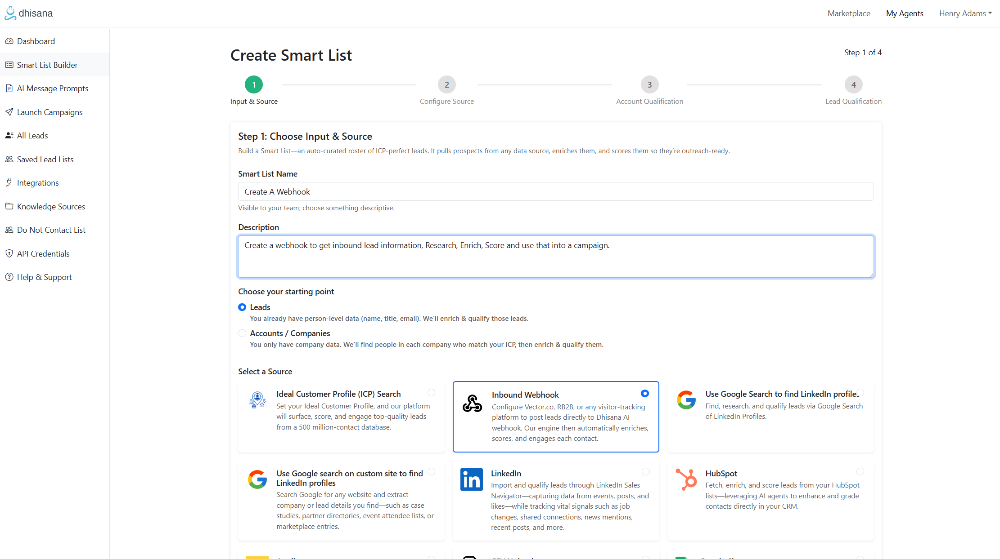
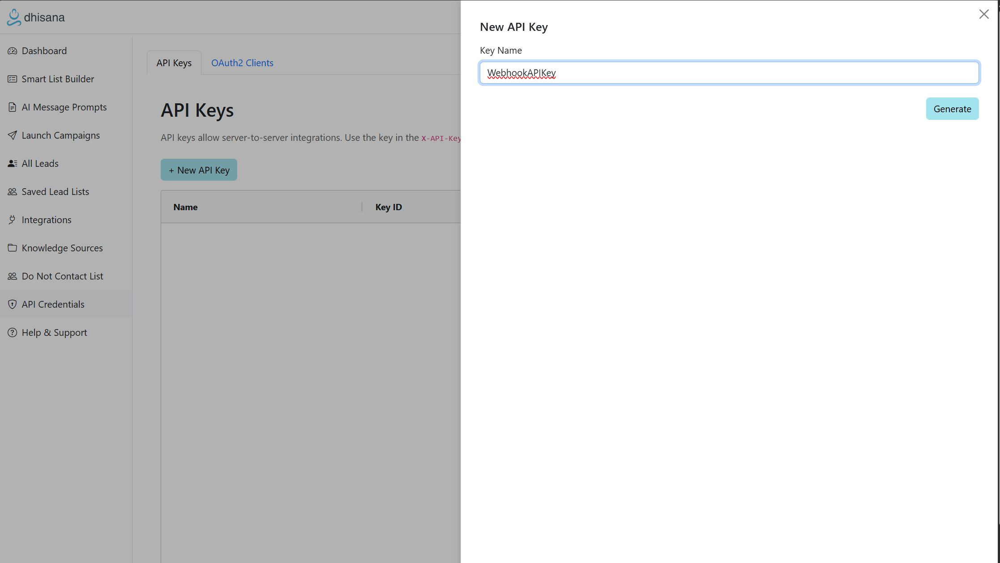

# Creating a Dhisana AI Webhook

Pushing a lead or company to a Dhisana AI webhook triggers an AI Agent to research,
qualify and score the record. Qualified leads are automatically added to the proper
outreach campaign.

## Step 1 – Create the Webhook

1. In Dhisana create a **Smart List** and choose the **Webhook** option.
2. Provide your qualification and scoring criteria.
3. Copy the webhook URL from the Smart List once created.

## Step 2 – Generate an API Key

1. Open the **API Credentials** page in Dhisana.
2. Click **New API Key** and copy the value shown.

## Add the Values to Your Configuration

Set `DHISANA_WEBHOOK_URL` and `DHISANA_API_KEY` in your environment or the app
settings page using the values from the steps above. After scraping any lead or
company info with these tools you can push it to Dhisana and let the platform
handle qualification and outreach.

